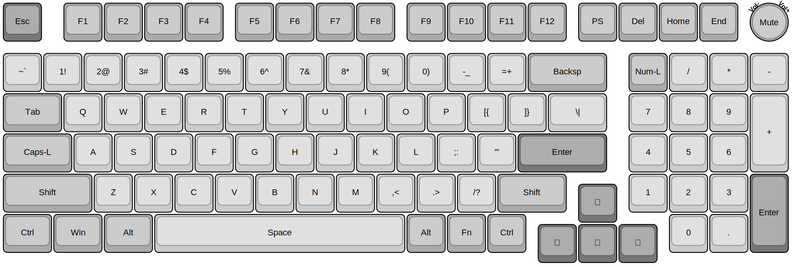
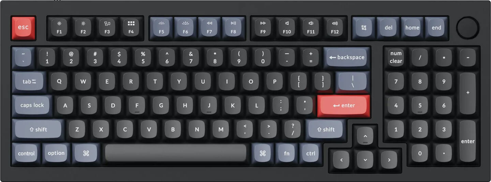
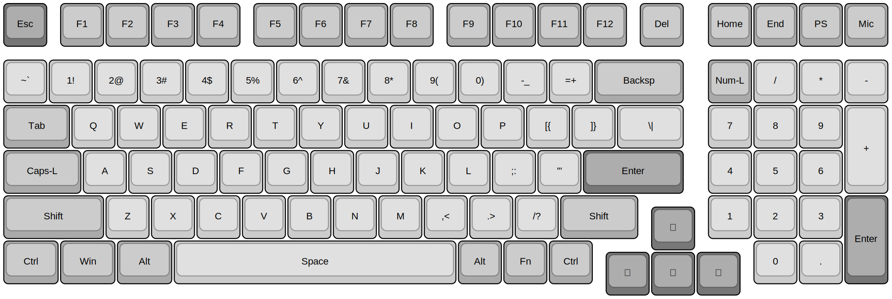
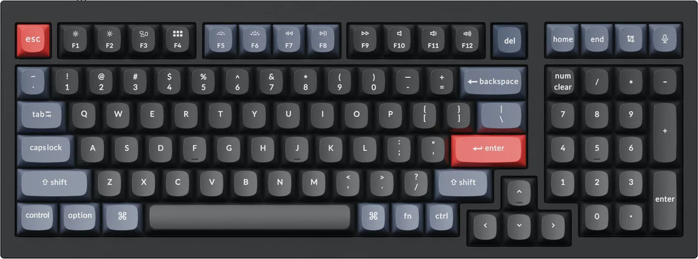

# VR98-Keyboard-PCB

> &#128679; Placeholder for future project &#128679;

### Encoder Variant

### 1800 Variant

## Intent

A 980-layout (98-key) compact near-full size keyboard for QMK feat. per-Key RGB and a top-right corner rotary encoder

## Planned Features

- [ ] QMK / Vial build
- [ ] 1x `STM32F411` STM32 CPU *(based on Black Pill design)*
      - `STM32F411CE`
      - 100Mhz Freq.
      - 128KB RAM
      - 512KB ROM
- [ ] 1x `W25Q64JW` 8K SPI Flash Module
- [ ] 1x `M95640-DRE` 8K SPI EEPROM Module
- [ ] 3x ~~`MC74HC589A`~~ *[TBD]* SPI Input Shift Registers
- [ ] 2x `IS31FL3745` I2C LED Matrix Drivers
    - 103x RGB LED's
- [ ] C3 UDB Usb-C 

## Possible BIG issues

- *(None forseen)*
