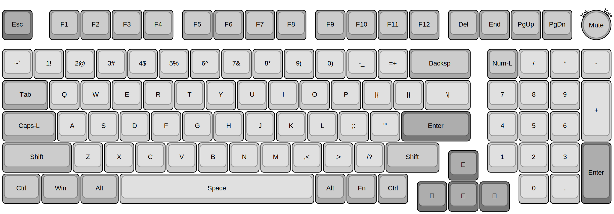
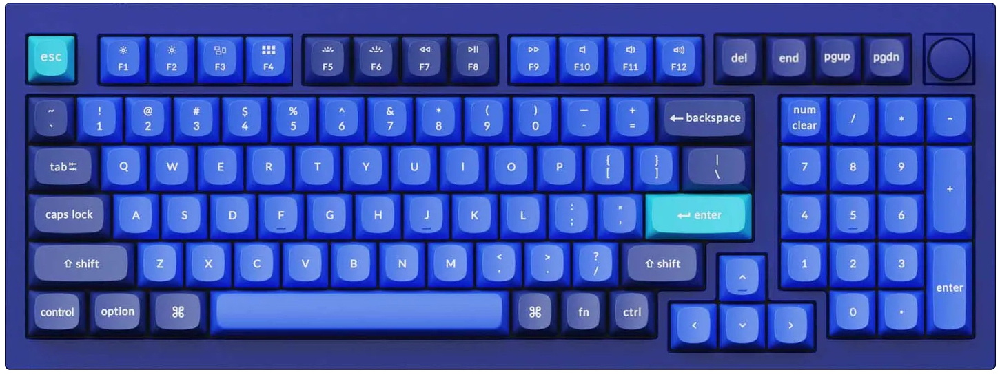

# VR98-Keyboard-PCB

> &#128679; Placeholder for future project &#128679;

## Intent

A 980-layout (98-key) compact near-full size keyboard for QMK feat. per-Key RGB and a top-right corner rotary encoder

## Planned Features

- [ ] QMK / Vial build
- [ ] 1x `STM32F411` STM32 CPU *(based on Black Pill design)*
- [ ] 1x `M95640-DRE` 8K SPI EEPROM Module
- [ ] 3x `MC74HC589A` SPI Input Shift Registers *- possibly faster scan rates*
- [ ] 2x `IS31FL3745` SPI LED Matrix Drivers
    - 103x RGB LED's
- [ ] C3/4 UDB Usb-C 

## Possible BIG issues

- *(None forseen)*
