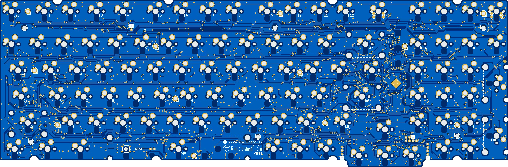
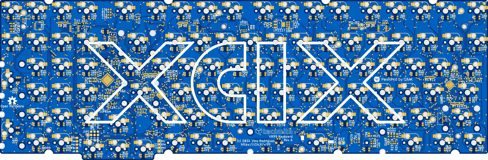
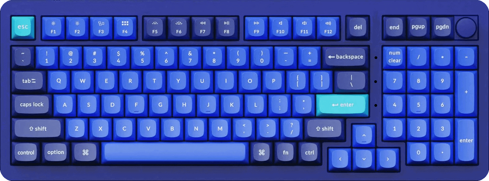
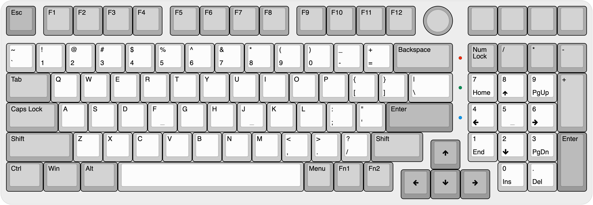

# SR99-Keyboard-PCB

> :warning: Design is done but not tested.  Please hold-off on building until the design can be verified and the software is written.

## Intent

A 980-layout (99-key) compact near-full size keyboard for QMK feat. per-key RGB and a top-right corner rotary encoder

## Progression

- **27 Sep 2024**: Beta 1 done
  - WARNING: Not manufactured *(yet)*
  - WARNING: Not tested *(yet)*
- See [CHANGELOG.md](CHANGELOG.md)

#### Rev A

> I'm not happy with the optics on this revision.  Looks like **Via Chicken Pox**!  Serves me right for self constraining to a 2-layer PCB.  I will re-do Rev B in 4-layer, however will proto. mnf. this rev. to test my theories on the:
>  - SPI Input Shift Registers
>  - SPI LED Matrix Drivers
>  - SKYLOONG rotary encoder
>
> This is more about writing the code after all.

### Resources

 - Schematic PDF [here](docs/sr99-revA.pdf)
 - EAGLE BRD *(PCB)* [here](EAGLE/sr99/sr99-revA.brd)
 - EAGLE SCH *(Schematic)* [here](EAGLE/sr99/sr99-revA.sch)

### Beta PCB renders

#### Top

#### Bottom *(Component side)*

### Layout ideation renders

#### Render

#### Layout

#### Matrix coordinates *(QMK & VIA)*

## Planned Features

- [ ] QMK build, with VIA support
- [ ] 1x `STM32F411` STM32 CPU *(based on Black Pill design)*
- [ ] 1x `M95640-DRE` 8K SPI EEPROM Module
- [ ] 3x `MC74HC589A` SPI Input Shift Registers *- possibly faster scan rates*
- [ ] 2x `IS31FL3745` SPI LED Matrix Drivers
    - 102x RGB LED's
- [ ] 2x SKYLOONG rotary encoder/switch positions *(wired for only one in use)*
- [ ] C3/4 UDB Usb-C 

#### Addons

- [ ] DIP Switch daughter board *(4-position)*
- [ ] ~~Case slide switch daughter board *(Win/Mac 2-state, + USB+BT+2.4GHz 3-state)*~~ *(To do)*

## Wishlist

- [ ] Drop in replacement PCB *(e.g. compatible standoff positions)* for:
    - Brutal v2 1800
    - Monsgeek M2
    - ~~Skyloong GK980~~ *(The GK980 has a 0.5U gap between Esc and F1, making it not the same footprint as the B1k8 and M2.)*

## Possible BIG issues

- [ ] SPI variant for the **`IS31FL3745B`** *(`A` is I2C, `B` is SPI)* has no driver in QMK, will need to code one up!!

&nbsp; &nbsp;
---
Made with :heart: by [**Silvino Rodrigues**](https://github.com/silvinor)
