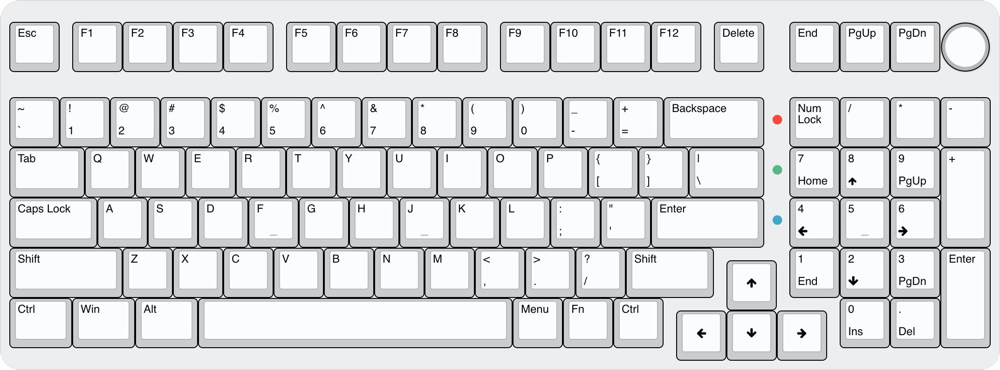

# SR99-Keyboard-PCB

> :warning: **WIP:** Work in Progress design, and is not tested.  Please hold-off on building until the design can be verified and the software is written.

## Intent

A 980-layout (99-key) compact near-full size keyboard.

## Progression

> :bangbang: This is a "when I'm bored" project - so "significant" progress is not expected.

- **15 Nov 2025**: Re-do!
  - EAGLE design abandoned in favour of KiCAD design
  - `STM32F411` discarded for **`STM32G474`**
- **27 Sep 2024**: Beta 1 done
  - :warning: Not manufactured
  - :warning: Not tested
- See [CHANGELOG.md](CHANGELOG.md)

<!--
### Resources

 - Schematic PDF [here](docs/sr99-revXXX.pdf)
 - EAGLE BRD *(PCB)* [here](EAGLE/sr99/sr99-revXXX.brd)
 - EAGLE SCH *(Schematic)* [here](EAGLE/sr99/sr99-revXXX.sch)
-->

<!--
### Beta PCB renders

#### Top

#### Bottom *(Component side)*

-->

### Layout ideation renders

#### Render

#### Layout

#### Matrix coordinates *(QMK & VIA)*

## Planned Features

- [ ] QMK build, with Via/l support
- [ ] 1x `STM32G474` STM32 CPU *(based on Black Pill design)*
- [ ] 1x `M95640-DRE` 8K SPI EEPROM Module
- [ ] 3x `MC74HC589A` SPI Input Shift Registers *- possibly faster scan rates*
- [ ] 2x `IS31FL3743B` RGB Drivers, with independent LDOs
- [ ] 2x SKYLOONG rotary encoder/switch positions
- [ ] UDB C-Series Usb-C JST-SH

<!--
#### Addons

- [ ] DIP Switch daughter board *(4-position)*
- [ ] ~~Case slide switch daughter board *(Win/Mac 2-state, + USB+BT+2.4GHz 3-state)*~~ *(To do)*
- [ ] USB 2.0 Hub
-->

<!--
## Wishlist

- [ ] Drop in replacement PCB *(e.g. compatible standoff positions)* for:
    - Brutal v2 1800
    - Monsgeek M2
    - ~~Skyloong GK980~~ *(The GK980 has a 0.5U gap between Esc and F1, making it not the same footprint as the B1k8 and M2.)*
-->

---

Made with :heart: by [**Silvino R**](https://github.com/silvinor)
